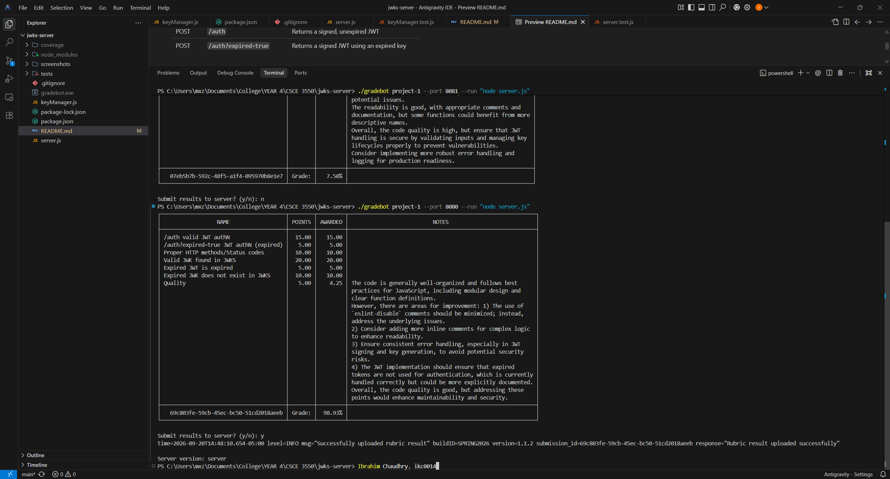
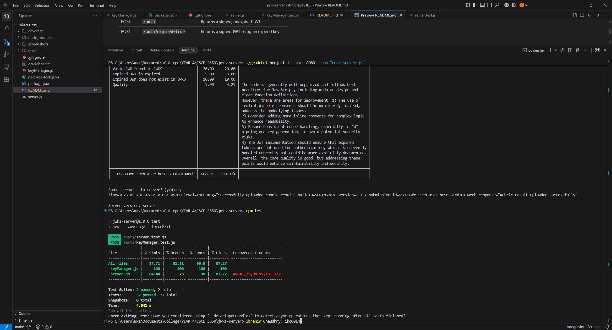

# JWKS Server

A RESTful JSON Web Key Set (JWKS) server that serves public keys for verifying JSON Web Tokens (JWTs). Built for CSCE 3550 - Foundations of Cybersecurity.

## Features

- RSA key pair generation with unique Key IDs (`kid`) and expiry timestamps
- JWKS endpoint serving only unexpired public keys in standard JWK format
- Authentication endpoint issuing signed JWTs (with optional expired JWT support)
- Proper RESTful HTTP method enforcement (405 Method Not Allowed, 404 Not Found)

## Tech Stack

- **Runtime:** Node.js
- **Framework:** Express.js v4
- **JWT Library:** jsonwebtoken
- **Testing:** Jest + Supertest

## Prerequisites

- [Node.js](https://nodejs.org/) (v18 or higher)
- [npm](https://www.npmjs.com/) (included with Node.js)

## Getting Started

### Clone the Repository

```bash
git clone https://github.com/IChaudhry892/jwks-server.git
cd jwks-server
```

### Install Dependencies

```bash
npm install
```

### Run the Server

```bash
node server.js
```

The server will start on `http://localhost:8080`.

## API Endpoints

| Method | Endpoint                    | Description                              |
|--------|-----------------------------|------------------------------------------|
| GET    | `/.well-known/jwks.json`    | Returns unexpired public keys in JWKS format |
| POST   | `/auth`                     | Returns a signed, unexpired JWT          |
| POST   | `/auth?expired=true`        | Returns a signed JWT using an expired key |

## Running the Test Client Against the Server

Ensure `gradebot.exe` is in the same directory as the `server.js` file.

```bash
./gradebot project-1 --port 8080 --run "node server.js"
```

This will build and run the server and then run the test client against it.

## Running the Test Suite

Run the full test suite with coverage:

```bash
npm test
```

This will run Jest with the `--coverage` flag, displaying a coverage report in the terminal.

## Manual Testing Examples

You can interact with the server manually using tools like `curl`. Ensure the server is running (`node server.js`) before trying these commands.

> **Note for Windows Users:** If you are using PowerShell, the `curl` command is often aliased to `Invoke-WebRequest`. You may need to use `curl.exe` instead of `curl` in the commands below for them to work properly.

**1. Fetch the JWKS (Valid Keys)**

```bash
curl http://localhost:8080/.well-known/jwks.json
```
*Expected Output: A JSON object containing an array of unexpired RSA public keys.*

**2. Issue a Valid JWT**

```bash
curl -X POST http://localhost:8080/auth
```
*Expected Output: A base64-encoded JWT string.*

**3. Issue an Expired JWT**

```bash
curl -X POST "http://localhost:8080/auth?expired=true"
```
*Expected Output: A base64-encoded JWT string signed with an expired key.*

### Verifying JWTs

You can take the JWT strings output from the `/auth` endpoints and paste them into the debugger at [jwt.io](https://jwt.io/) to decode the header and payload. You'll be able to verify that the `kid` (Key ID) matches one of the keys from the JWKS endpoint and check if the `exp` (expiration time) is in the past or future.

## Project Structure

```
jwks-server/
├── server.js              # Express server with JWKS and auth endpoints
├── keyManager.js          # RSA key pair generation and storage
├── tests/
│   ├── server.test.js     # Server endpoint tests (supertest)
│   └── keyManager.test.js # Key generation unit tests
├── package.json
└── README.md
```

## Screenshots

### Test Client Results


### Test Suite Results
